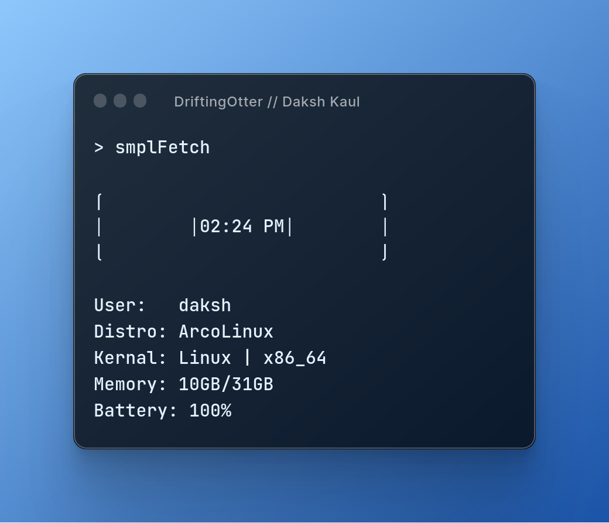

# smplFetch 🍎
> a simple C fetch script for linux.

## Compilation Of The C Script
One you have cloned/downloaded the script file run...

``` bash
gcc -Wall -Wextra -Werror -fstack-protector-strong -D_FORTIFY_SOURCE=2 -Wformat-security -pie -fPIE -O3 -flto -funroll-loops -finline-functions -fomit-frame-pointer -o smplFetch smplfetch.c
```

## Compatibility
It only works on linux as for right now, but I may add support for windows some time later if I have time.

## Authors
- Daksh Kaul (aka. me) 🦦
